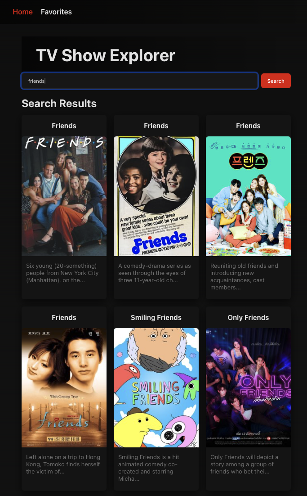
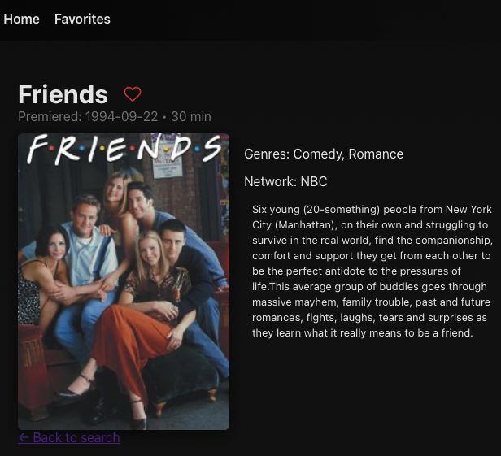
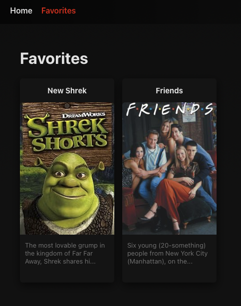

# TV Show Explorer

TV Show Explorer is a small frontend project built with Vue 3.

The app allows users to search for TV shows, open a show detail page, and save favorite shows to local storage. Data is loaded from the public TVmaze API.

## Why I built this project

I created this project to practice and strengthen the Vue knowledge I learned in a practical way.

The goal was to build a small but clean Vue application that shows:

* component-based structure
* routing with Vue Router
* working with API requests
* reusable logic with Composition API
* localStorage usage
* handling loading, error, empty, and not found states

This project is also meant to be a simple portfolio example focused only on Vue frontend development.

## Features

* Search TV shows by name
* View search results in a responsive grid
* Open a detail page for a selected show
* Add and remove favorite shows
* Persist favorites in localStorage
* Handle loading, error, empty, and 404 states

## Screenshots

### Home page



### Detail page



### Favorites page



## Project structure

```text
src/
  assets/          # screenshots and static assets
  components/      # reusable UI components
    buttons/
    search/
    shows/
  composables/     # reusable Vue logic
  router/          # route definitions
  services/        # API communication
  utils/           # helper functions
  views/           # page-level views
  App.vue
  main.js
  style.css
```

## Used dependencies

### Main dependencies

* `vue`
* `vue-router`
* `html-entities`

### Development dependencies

* `vite`
* `@vitejs/plugin-vue`
* `prettier`

## Installation and setup

Clone the repository:

```bash
git clone <your-repository-url>
```

Go to the project folder:

```bash
cd TV-Show-Explorer
```

Install dependencies:

```bash
npm install
```

Run the development server:

```bash
npm run dev
```

Build the project for production:

```bash
npm run build
```

Preview the production build:

```bash
npm run preview
```

## API

This project uses the public TVmaze API:

* Search shows: `/search/shows?q=:query`
* Show details: `/shows/:id`

## Notes

This project was intentionally kept small and focused.
The goal was not to build a large production system, but to create a clean Vue project that demonstrates practical frontend skills in a simple and understandable way.

## License

This project is open-source and available under the MIT License.

## Author

Tomáš Miščík (Interview Assignment)